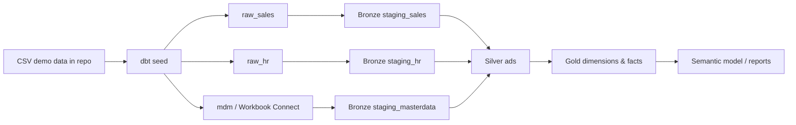

# Fabric dbt Accelerator

Demo `dbt-fabric` project for Microsoft Fabric Warehouse, designed as a starter template for Plainsight projects.

This repository demonstrates:

- Bronze / Silver / Gold layering using Plainsight semantics:
  - Bronze = `landing` / `staging` source-aligned models
  - Silver = ADS integrated analytical models
  - Gold = business-ready dimensions and facts
- Demo data as CSV files in the repository via dbt seeds.
- Multiple demo sources: Sales, HR, and Master Data.
- Workbook Connect as the master-data editing workflow for business-maintained mappings.
- Deterministic `BIGINT` primary and foreign keys generated from SHA2-based hashes.
- Model/source documentation, tests, exposures, SQLFluff config, and GitHub Actions CI skeleton.

> Target platform: **Microsoft Fabric Warehouse** via `dbt-fabric`.
> Fabric SQL analytics endpoints are read-only and are therefore not used as dbt transformation targets.

## Repository structure

The dbt project lives in [`dbt/`](dbt/); everything beside it is repository
infrastructure. Run all dbt commands from inside `dbt/`.

```text
.
├── .claude/skills/             # Claude Code skills (dbt conventions)
├── .github/workflows/          # GitHub Actions pipelines
│   ├── ci.yml                  # PR validation (lint, parse, slim CI build)
│   ├── ci-cleanup.yml          # PR closed: drop the pr_<N> schema
│   ├── build-dev.yml           # merge to dev: CI-workspace build + state manifest
│   ├── deploy-accept.yml       # merge to accept: deploy code to accept lakehouse
│   └── deploy-prod.yml         # merge to prod: deploy code to prod lakehouse
├── cicd/
│   ├── README.md               # CI/CD setup guide (branch strategy, both platforms)
│   ├── scripts/
│   │   └── deploy_to_onelake.sh# OneLake code deployment (shared by both platforms)
│   └── azure-devops/           # Azure DevOps mirrors with identical names
│       ├── ci.yml
│       ├── ci-cleanup.yml
│       ├── build-dev.yml
│       ├── deploy-accept.yml
│       ├── deploy-prod.yml
│       └── promote.yml
├── docs/
│   ├── ARCHITECTURE.md
│   ├── CLIENT_SETUP.md
│   ├── ci_architecture.md
│   ├── ONBOARDING.md
│   └── WORKBOOK_CONNECT.md
├── requirements/
│   └── requirements.txt        # pinned Python deps (dbt-fabric adapter)
├── dbt/                        # the dbt project - this is what ships to OneLake
│   ├── dbt_project.yml
│   ├── profiles.yml
│   ├── selectors.yml
│   ├── packages.yml
│   ├── dbt-bouncer.yml
│   ├── .sqlfluff-ci
│   ├── macros/
│   ├── models/
│   │   ├── bronze/staging/
│   │   ├── silver/{ads,intermediate}/
│   │   └── gold/marts/
│   ├── tests/
│   ├── snapshots/
│   └── analysis/
└── README.md
```

## Environments

Each environment maps to its **own Fabric workspace** (dev / accept / prod) —
**except `ci`, which must live in the SAME workspace as the `LH_source`
lakehouse**: every CI build reads the sources, and Fabric only allows
cross-database (three-part-name) queries between items in one workspace.
See [`docs/ci_architecture.md`](docs/ci_architecture.md).

| Target  | Authentication         | Trigger                                   | Schemas                                  |
| ------- | ---------------------- | ----------------------------------------- | ---------------------------------------- |
| `dev`   | Azure CLI (`az login`) | manual, developer machine                 | `dev_<username>_<layer>` (fully isolated, seeds included) |
| `ci`    | Service Principal      | PRs to `dev` (slim CI)                    | `pr_<PR number>` per pull request, dropped on PR close |
| `accept`| Service Principal      | code deployed to the lakehouse on merge to `accept`; dbt runs inside Fabric | shared layer schemas |
| `prod`  | Service Principal      | code deployed to the lakehouse on merge to `prod`; dbt runs inside Fabric   | shared layer schemas |

In `dev`, `generate_schema_name` prefixes every schema (models **and** seeds) with
your personal `target.schema` (`dev_<username>`), and the source definitions follow
along — every developer gets a fully isolated copy of the project. In CI, every
pull request builds into its own flat `pr_<PR number>` schema (cleaned up when
the PR closes). On `accept` and `prod` the plain layer schemas (`staging_sales`,
`ads`, `gold`, ...) are used.

### Branch strategy

```
feature/* ──PR──▶ dev ──weekly PR──▶ accept ──weekly PR──▶ prod
   (slim CI in      (build-dev:        (deploy-accept:       (deploy-prod:
    pr_<N> schema)   manifest only)     code → lakehouse)     code → lakehouse)
```

Feature branches are cut from `dev` and PR back into `dev` (validated by slim CI).
A weekly `promote` pipeline opens the promotion PRs — merge `accept -> prod`
first, then `dev -> accept`. Merging deploys the project **code** to that
workspace's lakehouse (OneLake); dbt execution on accept/prod happens inside
Fabric on its own internal schedule, never from the pipelines.
See [`cicd/README.md`](cicd/README.md).

## Quick start

### 1. Create and activate a Python environment

```bash
python -m venv .venv
source .venv/bin/activate  # Windows PowerShell: .venv\Scripts\Activate.ps1
pip install -r requirements/requirements.txt
```

> This project targets the `dbt-fabric` adapter only (Fabric Warehouse, T-SQL).
> `dbt-fabricspark` is intentionally not used.

### 2. Install dbt packages

Every dbt command below runs from the project folder:

```bash
cd dbt
dbt deps
```

### 3. Configure your local dbt profile

[`dbt/profiles.yml`](dbt/profiles.yml) is committed to the repo and already configured for all four
targets (`dev`/`ci`/`accept`/`prod`) - no copying or per-developer file needed.

The profile is driven by environment variables. For local development you only
need `DBT_FABRIC_HOST` and `DBT_FABRIC_DATABASE` (or edit the defaults in the
`dev` output). Your personal schema prefix is derived automatically from your
OS username (`dev_<username>`), so no per-developer profile edits are needed.

The `ci`, `accept`, and `prod` targets authenticate with a Service Principal via
`DBT_SP_TENANT_ID` / `DBT_SP_CLIENT_ID` / `DBT_SP_CLIENT_SECRET` — these are only
injected by the pipelines, never stored in files.

For local development with Azure CLI auth:

```bash
az login
dbt debug --profiles-dir .
```

### 4. Load demo CSV data

```bash
dbt seed --profiles-dir .
```

This creates demo raw tables from the CSV files in `seeds/`.

### 5. Build Bronze, Silver, and Gold

```bash
dbt build --profiles-dir .
```

Useful targeted commands:

```bash
dbt build --select tag:bronze --profiles-dir .
dbt build --select tag:silver --profiles-dir .
dbt build --select tag:gold --profiles-dir .
dbt docs generate --profiles-dir .
dbt docs serve --profiles-dir .
```

### Selectors

Named node selections live in [`dbt/selectors.yml`](dbt/selectors.yml):

```bash
dbt ls --selector bronze                 # all bronze staging models
dbt build --selector silver_and_upstream # silver + everything it depends on
dbt build --selector gold_star_schema    # gold marts + full upstream lineage
dbt build --selector sales_dashboard_refresh # everything the sales exposure needs
dbt build --selector full_build          # whole project (used by build-dev & deploys)

# Slim CI against the manifest published by build-dev (done automatically in CI):
dbt build --selector ci_modified --state ./state --defer
```

## Expected data flow



## Demo business process

This project models a small sales domain:

- Sales source: customers, products, orders, order lines.
- HR source: sales reps, teams, and regions.
- Master Data source: product category mappings maintained by the business through Workbook Connect.

Gold outputs:

- `dim_customer`
- `dim_product`
- `dim_sales_rep`
- `dim_date`
- `fact_sales`

## Bigint surrogate keys

Use `{{ surrogate_key_bigint([...]) }}` for deterministic `BIGINT` keys. Example:

```sql
{{ surrogate_key_bigint(["'sales'", 'customer_id']) }} as customer_pk
```

The key itself comes from `dbt_utils.generate_surrogate_key` (null sentinel, separator and casting are all handled there); the macro only folds that hash into a non-negative `BIGINT`, so facts and dimensions stay joinable on whole-number keys. Run `dbt deps` before building.

## Workbook Connect flow

Workbook Connect is used for the `mdm_product_category_mapping` table. The CSV in `seeds/mdm/` initializes demo data. In a real Fabric Warehouse, business users maintain that table via Workbook Connect, and dbt treats it as a source feeding Bronze/Silver/Gold.

See [`docs/WORKBOOK_CONNECT.md`](docs/WORKBOOK_CONNECT.md).

## CI/CD

Pipelines are provided for both **GitHub Actions** (`.github/workflows/`) and
**Azure DevOps** (`cicd/azure-devops/`) with **identical, platform-generic names**;
full setup instructions live in [`cicd/README.md`](cicd/README.md).

- **`ci`** (PR) → lint (`sqlfluff`), `dbt parse`, `dbt-bouncer` convention checks
  ([`dbt/dbt-bouncer.yml`](dbt/dbt-bouncer.yml)); PRs into `dev` also run **slim CI**:
  only modified models (+ dependents) are built into an isolated `pr_<PR number>`
  schema on the CI warehouse, followed by `dbt docs generate` to catch
  doc-generation errors early. One manifest, two roles: the `build-dev` manifest
  picks WHAT to build (`--state`) and tells unmodified refs WHERE to read from
  (`--defer-state`, defaulting to `--state` → the dev baseline in the CI
  warehouse). **Requires the CI warehouse to be in the same Fabric workspace as
  `LH_source`** — see [`docs/ci_architecture.md`](docs/ci_architecture.md).
- **`ci-cleanup`** (PR closed) → drops the PR's `pr_<PR number>` schema on the
  CI warehouse.
- **`build-dev`** (merge to `dev`) → full `dbt build` into the CI warehouse's
  layer schemas + publishes that run's manifest as the slim-CI state. The build
  is what makes the manifest safe to defer to: it describes relations that
  exist, not just code.
- **`deploy-accept` / `deploy-prod`** (merge to `accept` / `prod`) → `dbt compile`
  as validation gate, then upload of the project tree to the workspace's lakehouse
  (`Files/dbt_project` + `_EXTRACTED` marker) via
  [`cicd/scripts/deploy_to_onelake.sh`](cicd/scripts/deploy_to_onelake.sh).
  No dbt build from the pipeline — Fabric executes dbt internally on its own schedule,
  which is exactly why slim CI does not defer to accept.
- **`promote`** (weekly cron) → opens the `accept -> prod` and `dev -> accept`
  promotion PRs (humans merge; prod first, then accept).

## Success criteria checklist

- [x] Bronze/Silver/Gold split.
- [x] Demo CSV data committed in `seeds/`.
- [x] Documentation in README, docs folder, and dbt YAML descriptions.
- [x] Multiple sources: Sales, HR, Master Data.
- [x] Workbook Connect master-data workflow documented.
- [x] `BIGINT` primary keys generated from hashes.
- [x] Tests and CI skeleton.
