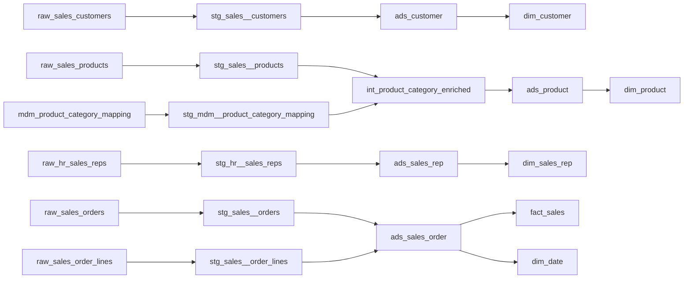

# Architecture

## Design decision

This accelerator targets **Microsoft Fabric Warehouse** with the `dbt-fabric` adapter. It uses schemas to represent Plainsight layers:

| Medallion | Plainsight semantic layer | Demo schemas | Responsibility |
|---|---|---|---|
| Bronze | Landing/Staging | `raw_sales`, `raw_hr`, `mdm`, `staging_sales`, `staging_hr`, `staging_masterdata` | Raw or source-aligned data with minimal transformations and audit fields. |
| Silver | ADS | `ads` | Cleansed, integrated, conformed entities ready for business modeling. |
| Gold | Business products | `gold` | Dimensional model for semantic models and reporting. |

## Source systems

1. **Sales**: operational order/customer/product data.
2. **HR**: sales-rep organization data.
3. **Master Data**: business-owned product category mappings maintained through Workbook Connect.

## Why the Master Data layer matters

Product categories are intentionally not hardcoded in SQL. They are treated as governed reference data. The CSV seed initializes the demo table, but the intended production workflow is:

1. Fabric Warehouse hosts `mdm.mdm_product_category_mapping`.
2. Business owners edit it through Workbook Connect from Excel.
3. dbt reads it through the `master_data` source.
4. Intermediate `int_product_category_enriched` joins products to category
   attributes; silver `ads_product` consumes it and adds `is_current`.
5. Gold `dim_product` exposes the business-ready category hierarchy.

## Key strategy

All analytical PK/FK columns use whole-number keys:

- Dimension keys: `customer_key`, `product_key`, `sales_rep_key`, `date_key`.
- Fact key: `sales_fact_key`.
- Relationship keys in facts are `BIGINT` except `date_key`, which uses `YYYYMMDD` integer convention.

The `surrogate_key_bigint` macro — one `SHA2_256` pass over the normalised
natural key, folded into a non-negative `BIGINT` — makes keys deterministic
across runs and environments, and case-insensitive.

## Run logging (`meta` schema)

Accept and prod are executed by the Fabric runtime on its own schedule, not by a
CI pipeline, so there is no build log to inspect after the fact. The
`on-run-end` hook in [`dbt_project.yml`](../dbt/dbt_project.yml) closes that gap by
writing what dbt just did into the same warehouse
([`macros/log_run_results.sql`](../dbt/macros/log_run_results.sql)):

| Table | Grain | Holds |
|---|---|---|
| `meta.dim_dbt_nodes` | one row per dbt node (SCD type 1) | name, resource type, materialization, package, database/schema, file path, first/last seen |
| `meta.fct_dbt_runs` | one row per node per invocation | invocation id, command, target, start/end/duration, status (+ success/error/skipped flags), rows affected, test failures, message |

`sk_dbt_node` is a deterministic `surrogate_key_bigint` of the node's
`unique_id`, derived identically on both sides, so the fact needs no dimension
lookup and can never orphan.

Both tables are created on first use — accept and prod are deployed as project
code with no migration step. The hook is inert on every other target
(`dbt_run_log_targets`, default `['accept', 'prod']`) and never fires on
`dbt compile`, which is all the deploy pipelines run, so deploying the project
never writes to prod. Override `dbt_run_log_schema` / `dbt_run_log_targets` to
exercise it from a dev sandbox.

## Model lineage

